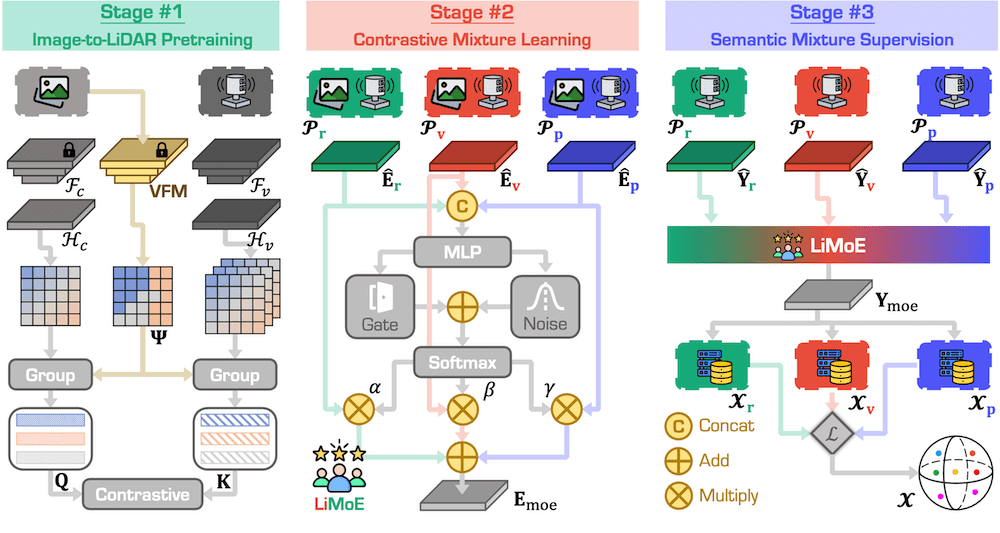
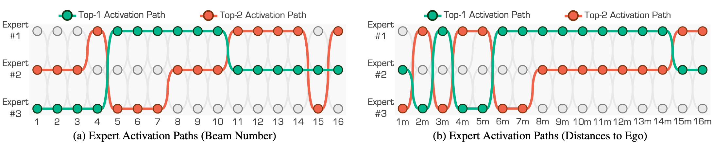
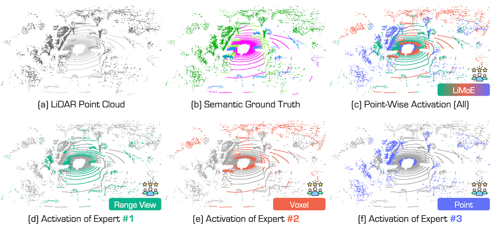
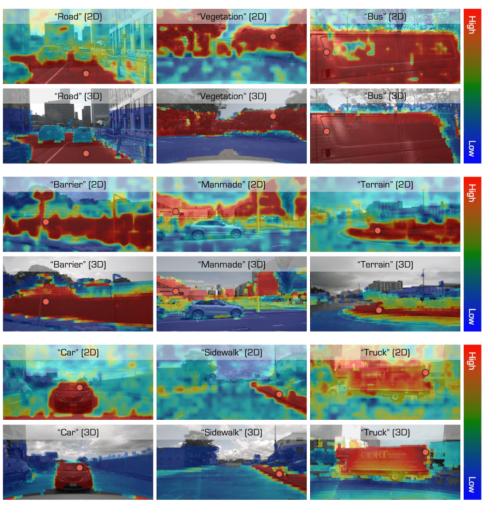
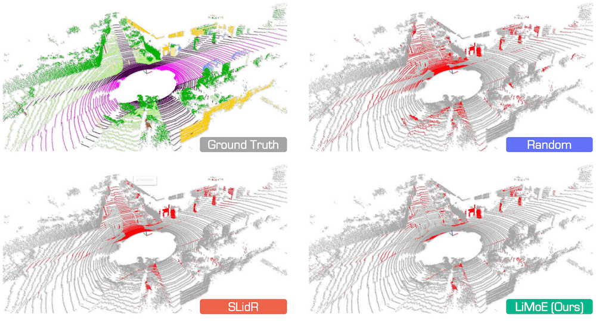

<div align="right">English | <a href="./README_CN.md">简体中文</a></div>

<div align="center">
    
    <h2><strong>LiMoE: Mixture of LiDAR Representation Learners from Automotive Scenes</strong></h2>
</div>

<div align="center">
    <a href="https://xiangxu-0103.github.io/" target='_blank'>Xiang Xu</a><sup>*,1</sup>&nbsp;&nbsp;&nbsp;
    <a href="https://ldkong.com/" target='_blank'>Lingdong Kong</a><sup>*,2,3</sup>&nbsp;&nbsp;&nbsp;
    <a href="https://scholar.google.com/citations?user=zG3rgUcAAAAJ" target='_blank'>Hui Shuai</a><sup>4</sup>&nbsp;&nbsp;&nbsp;
    <a href="https://scholar.google.com/citations?user=lSDISOcAAAAJ" target='_blank'>Liang Pan</a><sup>3</sup>&nbsp;&nbsp;&nbsp;
    <a href="https://liuziwei7.github.io/" target='_blank'>Ziwei Liu</a><sup>5</sup>&nbsp;&nbsp;&nbsp;
    <a href="https://scholar.google.com/citations?user=2Pyf20IAAAAJ" target='_blank'>Qingshan Liu</a><sup>4</sup>
    </br></br>
    <sup>1</sup>NUAA&nbsp;&nbsp;&nbsp;
    <sup>2</sup>NUS&nbsp;&nbsp;&nbsp;
    <sup>3</sup>Shanghai AI Lab&nbsp;&nbsp;&nbsp;
    <sup>4</sup>NJUPT&nbsp;&nbsp;&nbsp;
    <sup>5</sup>S-Lab, NTU
</div>

<br/>

<div align="center">
    <a href="https://arxiv.org/abs/2501.04004" target='_blank'>
        
    </a>&nbsp;
    <a href="https://ldkong.com/LiMoE" target='_blank'>
        
    </a>&nbsp;
    <a >
        
    </a>&nbsp;
    <a >
        
    </a>&nbsp;
    <a href="https://hits.seeyoufarm.com">
        
  </a>
</div>

# About

LiMoE is a framework that integrates the Mixture of Experts (MoE) paradigm into LiDAR data representation learning to synergistically combine multiple representations, such as range images, sparse voxels, and raw points. The framework consists of three stages: i) Image-to-LiDAR pretraining, which transfers prior knowledge from images to point clouds across different representations; ii) Contrastive Mixture Learning (CML), which uses MoE to adaptively activate relevant attributes from each representation and distills these mixed features into a unified 3D network; iii) Semantic Mixture Supervision (SMS), which combines semantic logits from multiple representations to boost downstream segmentation performance.



## :memo: Updates

- \[2025.02\] - Our paper **LiMoE** has been accepted to **CVPR 2025**! :tada:
- \[2025.01\] - Introducing the :family_man_boy_boy: **LiMoE** project! For more details, kindly refer to our [Project Page](https://ldkong.com/LiMoE) and [Preprint](https://arxiv.org/abs/2501.04004). :rocket:

# Table of Content

- [Installation](#gear-installation)
- [Data Preparation](#hotsprings-data-preparation)
- [Getting Started](#rocket-getting-started)
- [Main Results](#bar_chart-main-results)
- [License](#license)
- [Citation](#citation)
- [Acknowledgments](#acknowledgments)

# :gear: Installation

For details related to installation and environment setups, kindly refer to [INSTALL.md](./docs/INSTALL.md).

# :hotsprings: Data Preparation

Kindly refer to [DATA_PREPAER.md](./docs/DATA_PREPAER.md) for the details to prepare the datasets.

# :rocket: Getting Started

To learn more usage about this codebase, kindly refer to [GET_STARTED.md](./docs/GET_STARTED.md).

# :bar_chart: Main Results

## Comparisons of State-of-the-Art Pretraining Methods

<table>
    <tr>
        <th rowspan="2">Method</th>
        <th rowspan="2">Distill</th>
        <th colspan="6">nuScenes</th>
        <th colspan="1">KITTI</th>
        <th colspan="1">Waymo</th>
    </tr>
    <tr>
        <td>LP</td>
        <td>1%</td>
        <td>5%</td>
        <td>10%</td>
        <td>25%</td>
        <td>Full</td>
        <td>1%</td>
        <td>1%</td>
    </tr>
    <tr>
        <td>Random</td>
        <td>-</td>
        <td>8.10</td>
        <td>30.30</td>
        <td>47.84</td>
        <td>56.15</td>
        <td>65.48</td>
        <td>74.66</td>
        <td>39.50</td>
        <td>39.41</td>
    </tr>
    <tr>
        <td>SLiDR</td>
        <td>ViT-S</td>
        <td>44.70</td>
        <td>41.16</td>
        <td>53.65</td>
        <td>61.47</td>
        <td>66.71</td>
        <td>74.20</td>
        <td>44.67</td>
        <td>47.57</td>
    </tr>
    <tr>
        <td>+LiMoE</td>
        <td>ViT-S</td>
        <td>45.80</td>
        <td>46.82</td>
        <td>57.54</td>
        <td>63.85</td>
        <td>68.61</td>
        <td>75.64</td>
        <td>46.81</td>
        <td>48.81</td>
    </tr>
    <tr>
        <td>Seal</td>
        <td>ViT-S</td>
        <td>45.16</td>
        <td>44.27</td>
        <td>55.13</td>
        <td>62.46</td>
        <td>67.64</td>
        <td>75.58</td>
        <td>46.51</td>
        <td>48.67</td>
    </tr>
    <tr>
        <td>SuperFlow</td>
        <td>ViT-S</td>
        <td>46.44</td>
        <td>47.81</td>
        <td>59.44</td>
        <td>64.47</td>
        <td>69.20</td>
        <td>76.54</td>
        <td>47.97</td>
        <td>49.94</td>
    </tr>
    <tr>
        <td>+LiMoE</td>
        <td>ViT-S</td>
        <td>48.20</td>
        <td>49.60</td>
        <td>60.54</td>
        <td>65.65</td>
        <td>71.39</td>
        <td>77.27</td>
        <td>49.53</td>
        <td>51.42</td>
    </tr>
    <tr>
        <td>SLiDR</td>
        <td>ViT-B</td>
        <td>45.35</td>
        <td>41.64</td>
        <td>55.83</td>
        <td>62.68</td>
        <td>67.61</td>
        <td>74.98</td>
        <td>45.50</td>
        <td>48.32</td>
    </tr>
    <tr>
        <td>+LiMoE</td>
        <td>ViT-B</td>
        <td>46.56</td>
        <td>46.89</td>
        <td>58.09</td>
        <td>63.87</td>
        <td>69.02</td>
        <td>75.87</td>
        <td>47.96</td>
        <td>49.50</td>
    </tr>
    <tr>
        <td>Seal</td>
        <td>ViT-B</td>
        <td>46.59</td>
        <td>45.98</td>
        <td>57.15</td>
        <td>62.79</td>
        <td>68.18</td>
        <td>75.41</td>
        <td>47.24</td>
        <td>48.91</td>
    </tr>
    <tr>
        <td>SuperFlow</td>
        <td>ViT-S</td>
        <td>47.66</td>
        <td>48.09</td>
        <td>59.66</td>
        <td>64.52</td>
        <td>69.79</td>
        <td>76.57</td>
        <td>48.40</td>
        <td>50.20</td>
    </tr>
    <tr>
        <td>+LiMoE</td>
        <td>ViT-B</td>
        <td>49.07</td>
        <td>50.23</td>
        <td>61.51</td>
        <td>66.17</td>
        <td>71.56</td>
        <td>77.81</td>
        <td>50.30</td>
        <td>51.77</td>
    </tr>
    <tr>
        <td>SLiDR</td>
        <td>ViT-L</td>
        <td>45.70</td>
        <td>42.77</td>
        <td>57.45</td>
        <td>63.20</td>
        <td>68.13</td>
        <td>75.51</td>
        <td>47.01</td>
        <td>48.60</td>
    </tr>
    <tr>
        <td>+LiMoE</td>
        <td>ViT-L</td>
        <td>47.43</td>
        <td>46.92</td>
        <td>58.41</td>
        <td>64.54</td>
        <td>69.69</td>
        <td>76.32</td>
        <td>48.25</td>
        <td>50.23</td>
    </tr>
    <tr>
        <td>Seal</td>
        <td>ViT-L</td>
        <td>46.81</td>
        <td>46.27</td>
        <td>58.14</td>
        <td>63.27</td>
        <td>68.67</td>
        <td>75.66</td>
        <td>47.55</td>
        <td>50.02</td>
    </tr>
    <tr>
        <td>SuperFlow</td>
        <td>ViT-L</td>
        <td>48.01</td>
        <td>49.95</td>
        <td>60.72</td>
        <td>65.09</td>
        <td>70.01</td>
        <td>77.19</td>
        <td>49.07</td>
        <td>50.67</td>
    </tr>
    <tr>
        <td>+LiMoE</td>
        <td>ViT-L</td>
        <td>49.35</td>
        <td>51.41</td>
        <td>62.07</td>
        <td>66.64</td>
        <td>71.59</td>
        <td>77.85</td>
        <td>50.69</td>
        <td>51.93</td>
    </tr>
</table>

## Domain Generalization Study

<table>
    <tr>
        <th rowspan="2">Method</th>
        <th colspan="2">ScriKITTI</th>
        <th colspan="2">Rellis-3D</th>
        <th colspan="2">SemPOSS</th>
        <th colspan="2">SemSTF</th>
        <th colspan="2">SynLiDAR</th>
        <th colspan="2">DAPS-3D</th>
        <th colspan="2">Synth4D</th>
    </tr>
    <tr>
        <td>1%</td>
        <td>10%</td>
        <td>1%</td>
        <td>10%</td>
        <td>Half</td>
        <td>Full</td>
        <td>Half</td>
        <td>Full</td>
        <td>1%</td>
        <td>10%</td>
        <td>Half</td>
        <td>Full</td>
        <td>1%</td>
        <td>10%</td>
    </tr>
    <tr>
        <td>Random</td>
        <td>23.81</td>
        <td>47.60</td>
        <td>38.46</td>
        <td>53.60</td>
        <td>46.26</td>
        <td>54.12</td>
        <td>48.03</td>
        <td>48.15</td>
        <td>19.89</td>
        <td>44.74</td>
        <td>74.32</td>
        <td>79.38</td>
        <td>20.22</td>
        <td>66.87</td>
    </tr>
    <tr>
        <td>PPKT</td>
        <td>36.50</td>
        <td>51.67</td>
        <td>49.71</td>
        <td>54.33</td>
        <td>50.18</td>
        <td>56.00</td>
        <td>50.92</td>
        <td>54.69</td>
        <td>37.57</td>
        <td>46.48</td>
        <td>78.90</td>
        <td>84.00</td>
        <td>61.10</td>
        <td>62.41</td>
    </tr>
    <tr>
        <td>SLiDR</td>
        <td>39.60</td>
        <td>50.45</td>
        <td>49.75</td>
        <td>54.57</td>
        <td>51.56</td>
        <td>55.36</td>
        <td>52.01</td>
        <td>54.35</td>
        <td>42.05</td>
        <td>47.84</td>
        <td>81.00</td>
        <td>85.40</td>
        <td>63.10</td>
        <td>62.67</td>
    </tr>
    <tr>
        <td>+LiMoE</td>
        <td>41.48</td>
        <td>53.41</td>
        <td>51.28</td>
        <td>55.21</td>
        <td>53.14</td>
        <td>56.42</td>
        <td>53.16</td>
        <td>55.51</td>
        <td>43.72</td>
        <td>49.57</td>
        <td>81.70</td>
        <td>85.76</td>
        <td>64.69</td>
        <td>66.79</td>
    </tr>
    <tr>
        <td>Seal</td>
        <td>40.64</td>
        <td>52.77</td>
        <td>51.09</td>
        <td>55.03</td>
        <td>53.26</td>
        <td>56.89</td>
        <td>53.46</td>
        <td>55.36</td>
        <td>43.58</td>
        <td>49.26</td>
        <td>81.88</td>
        <td>85.90</td>
        <td>64.50</td>
        <td>66.96</td>
    </tr>
    <tr>
        <td>SuperFlow</td>
        <td>42.70</td>
        <td>54.00</td>
        <td>52.83</td>
        <td>55.71</td>
        <td>54.41</td>
        <td>57.33</td>
        <td>54.72</td>
        <td>56.57</td>
        <td>44.85</td>
        <td>51.38</td>
        <td>82.43</td>
        <td>86.21</td>
        <td>65.31</td>
        <td>69.43</td>
    </tr>
    <tr>
        <td>+LiMoE</td>
        <td>43.95</td>
        <td>55.96</td>
        <td>53.74</td>
        <td>56.67</td>
        <td>55.42</td>
        <td>57.83</td>
        <td>55.60</td>
        <td>57.31</td>
        <td>45.79</td>
        <td>52.27</td>
        <td>83.24</td>
        <td>86.68</td>
        <td>66.54</td>
        <td>71.07</td>
    </tr>
</table>

## Expert Activation Paths

|                                                                                                                                    |
| :---------------------------------------------------------------------------------------------------------------------------------------------------------------: |
| Visual interpretations of the expert activation paths in Contrastive Mixture Learning (CML). The experts are #1 range view, #2 voxel, and #3 point, respectively. |

## Point-Wise Top-1 Activation

|                                                                                                                                                                                                                                                                                         |
| :--------------------------------------------------------------------------------------------------------------------------------------------------------------------------------------------------------------------------------------------------------------------------------------------------------------------------------: |
| Point-wise top-1 activation path in the Semantic Mixture Supervision (SMS) stage. It highlights the most activated representation for each point during the SMS stage, illustrating how different representations contribute to semantic segmentation based on spatial and object-specific characteristics. Best viewed in colors. |

## Out-of-Distribution 3D Robustness

<table>
    <tr>
        <th>#</th>
        <th>Method</th>
        <th>mCE</th>
        <th>mRR</th>
        <th>Fog</th>
        <th>Rain</th>
        <th>Snow</th>
        <th>Blur</th>
        <th>Beam</th>
        <th>Cross</th>
        <th>Echo</th>
        <th>Sensor</th>
        <th>Avg</th>
    </tr>
    <tr>
        <td rowspan="7">Full</td>
        <td>Random</td>
        <td>112.20</td>
        <td>72.57</td>
        <td>62.96</td>
        <td>70.65</td>
        <td>55.48</td>
        <td>51.71</td>
        <td>62.01</td>
        <td>31.56</td>
        <td>59.64</td>
        <td>39.41</td>
        <td>54.18</td>
    </tr>
    <tr>
        <td>PPKT</td>
        <td>105.64</td>
        <td>75.87</td>
        <td>64.01</td>
        <td>72.18</td>
        <td>59.08</td>
        <td>57.17</td>
        <td>63.88</td>
        <td>36.34</td>
        <td>60.59</td>
        <td>39.57</td>
        <td>56.60</td>
    </tr>
    <tr>
        <td>SLidR</td>
        <td>106.08</td>
        <td>75.99</td>
        <td>65.41</td>
        <td>72.31</td>
        <td>56.01</td>
        <td>56.07</td>
        <td>62.87</td>
        <td>41.94</td>
        <td>61.16</td>
        <td>38.90</td>
        <td>56.83</td>
    </tr>
    <tr>
        <td>+LiMoE</td>
        <td>101.74</td>
        <td>77.77</td>
        <td>67.92</td>
        <td>73.25</td>
        <td>57.02</td>
        <td>56.30</td>
        <td>64.72</td>
        <td>44.81</td>
        <td>61.23</td>
        <td>45.37</td>
        <td>58.83</td>
    </tr>
    <tr>
        <td>Seal</td>
        <td>92.63</td>
        <td>83.08</td>
        <td>72.66</td>
        <td>74.31</td>
        <td>66.22</td>
        <td>66.14</td>
        <td>65.96</td>
        <td>57.44</td>
        <td>59.87</td>
        <td>39.85</td>
        <td>62.81</td>
    </tr>
    <tr>
        <td>SuperFlow</td>
        <td>91.67</td>
        <td>83.17</td>
        <td>70.32</td>
        <td>75.77</td>
        <td>65.41</td>
        <td>61.05</td>
        <td>68.09</td>
        <td>60.02</td>
        <td>58.36</td>
        <td>50.41</td>
        <td>63.68</td>
    </tr>
    <tr>
        <td>+LiMoE</td>
        <td>88.43</td>
        <td>83.28</td>
        <td>71.10</td>
        <td>75.92</td>
        <td>65.66</td>
        <td>63.86</td>
        <td>68.52</td>
        <td>60.78</td>
        <td>61.91</td>
        <td>50.66</td>
        <td>64.80</td>
    </tr>
    <tr>
        <td rowspan="6">LP</td>
        <td>PPKT</td>
        <td>183.44</td>
        <td>78.15</td>
        <td>30.65</td>
        <td>35.42</td>
        <td>28.12</td>
        <td>29.21</td>
        <td>32.82</td>
        <td>19.52</td>
        <td>28.01</td>
        <td>20.71</td>
        <td>28.06</td>
    </tr>
    <tr>
        <td>SLidR</td>
        <td>179.38</td>
        <td>77.18</td>
        <td>34.88</td>
        <td>38.09</td>
        <td>32.64</td>
        <td>26.44</td>
        <td>33.73</td>
        <td>20.81</td>
        <td>31.54</td>
        <td>21.44</td>
        <td>29.95</td>
    </tr>
    <tr>
        <td>+LiMoE</td>
        <td>163.75</td>
        <td>75.49</td>
        <td>37.29</td>
        <td>43.41</td>
        <td>36.04</td>
        <td>38.33</td>
        <td>40.66</td>
        <td>22.46</td>
        <td>37.61</td>
        <td>25.38</td>
        <td>35.15</td>
    </tr>
    <tr>
        <td>Seal</td>
        <td>166.18</td>
        <td>75.38</td>
        <td>37.33</td>
        <td>42.77</td>
        <td>29.93</td>
        <td>37.73</td>
        <td>40.32</td>
        <td>20.31</td>
        <td>37.73</td>
        <td>24.94</td>
        <td>33.88</td>
    </tr>
    <tr>
        <td>SuperFlow</td>
        <td>161.78</td>
        <td>75.52</td>
        <td>37.59</td>
        <td>43.42</td>
        <td>37.60</td>
        <td>39.57</td>
        <td>41.40</td>
        <td>23.64</td>
        <td>38.03</td>
        <td>26.69</td>
        <td>35.99</td>
    </tr>
    <tr>
        <td>+LiMoE</td>
        <td>155.77</td>
        <td>78.23</td>
        <td>40.35</td>
        <td>45.28</td>
        <td>39.14</td>
        <td>42.10</td>
        <td>44.21</td>
        <td>27.33</td>
        <td>39.20</td>
        <td>29.49</td>
        <td>38.39</td>
    </tr>
</table>

## Cosine Similarity

|                                                                                                                                                                                                                                  |
| :-------------------------------------------------------------------------------------------------------------------------------------------------------------------------------------------------------------------------------------------------------------------: |
| Cosine similarity between learned features of a query point (denoted as the red dot) and: (1) the features of the image of the same scene (the first row); and (2) the features of the LiDAR points projected onto the image (the second row). Best viewed in colors. |

## Qualitative Assessment

|                                                                                                                                                                                                               |
| :--------------------------------------------------------------------------------------------------------------------------------------------------------------------------------------------------------------------------------------------------------: |
| Qualitative assessments of state-of-the-art pretraining methods, pretrained on nuScenes and fine-tuned on SemanticKITTI with 1% annotations. The error maps depict correct and incorrect predictions in gray and red, respectively. Best viewed in colors. |

# License

This work is under the [Apache License Version 2.0](https://www.apache.org/licenses/LICENSE-2.0), while some specific implementations in this codebase might be with other licenses.

Kindly refer to [LICENSE.md](./docs/LICENSE.md) for a more careful check, if you are using our code for commercial matters.

# Citation

If you find this work helpful for your research, please kindly consider citing our paper:

```bibtex
@article{xu2025limoe,
    title = {LiMoE: Mixture of LiDAR Representation Learners from Automotive Scenes},
    author = {Xu, Xiang and Kong, Lingdong and Shuai, Hui and Pan, Liang and Liu, Ziwei and Liu, Qingshan},
    journal = {arXiv preprint arXiv:2501.04004},
    year = {2025}
}
```

# Acknowledgments

This work is developed based on the [MMDetection3D](https://github.com/open-mmlab/mmdetection3d) codebase.

> <br>
> MMDetection3D is an open-source object detection toolbox based on PyTorch, towards the next-generation platform for general 3D perception. It is a part of the OpenMMLab project developed by MMLab.

We acknowledge the use of the following public resources during the couuse of this work: <sup>1</sup>[nuScenes](https://www.nuscenes.org/nuscenes), <sup>2</sup>[nuScenes-devkit](https://github.com/nutonomy/nuscenes-devkit), <sup>3</sup>[SemanticKITTI](http://www.semantic-kitti.org), <sup>4</sup>[SemanticKITTI-API](https://github.com/PRBonn/semantic-kitti-api), , <sup>5</sup>[WaymoOpenDataset](https://waymo.com/open), <sup>6</sup>[Synth4D](https://github.com/saltoricristiano/gipso-sfouda), <sup>7</sup>[ScribbleKITTI](https://github.com/ouenal/scribblekitti), <sup>8</sup>[RELLIS-3D](https://github.com/unmannedlab/RELLIS-3D), <sup>9</sup>[SemanticPOSS](http://www.poss.pku.edu.cn/semanticposs.html), <sup>10</sup>[SemanticSTF](https://github.com/xiaoaoran/SemanticSTF), <sup>11</sup>[SynthLiDAR](https://github.com/xiaoaoran/SynLiDAR), <sup>12</sup>[DAPS-3D](https://github.com/subake/DAPS3D), <sup>13</sup>[Robo3D](https://github.com/ldkong1205/Robo3D), <sup>14</sup>[SLidR](https://github.com/valeoai/SLidR), <sup>15</sup>[DINOv2](https://github.com/facebookresearch/dinov2), <sup>16</sup>[FRNet](https://github.com/Xiangxu-0103/FRNet), <sup>17</sup>[SuperFlow](https://github.com/Xiangxu-0103/SuperFlow), <sup>18</sup>[torchsparse](https://github.com/mit-han-lab/torchsparse), <sup>19</sup>[Conv-LoRA](https://github.com/autogluon/autogluon), <sup>20</sup>[MoE-LLaVA](https://github.com/PKU-YuanGroup/MoE-LLaVA). :heart_decoration:
